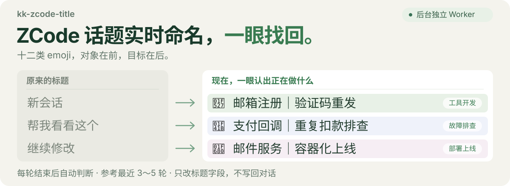
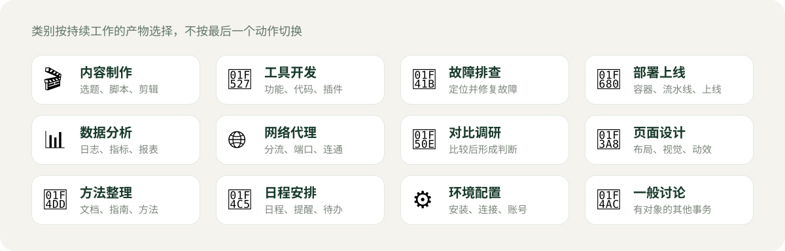

<p align="center">
  
</p>

<p align="center">
  
  
  
  
</p>

每轮对话结束后，**kk-zcode-title** 会在后台读最近 3～5 轮内容，把 ZCode 话题标题维护成稳定的 **「类别 emoji + 对象｜目标」** 格式。你正常聊天就行，侧边栏会自己变得一眼可辨。

## 让 Agent 帮你装

复制这段发给 ZCode：

```text
安装并启用这个 ZCode 插件：https://github.com/kkfor30/kk-zcode-title
装好后用一小段话告诉我：它能做什么、怎么用，以及我接下来还需要做什么（比如重启或配置）。
```

装好之后不需要记任何命令——直接说「预览这个话题的新标题」「固定这个话题的标题」「暂停自动命名」，它会照做。

## 手动安装

需要 Python 3.10 及以上，无第三方依赖。

**方式一：下载压缩包**

1. 下载 [kk-zcode-title.zip](https://github.com/kkfor30/kk-zcode-title/releases/latest/download/kk-zcode-title.zip) 并解压，放在哪里都行
2. 执行 `python install.py`
3. 重启 ZCode

**方式二：克隆仓库**

```bash
git clone https://github.com/kkfor30/kk-zcode-title.git
cd kk-zcode-title && python install.py
```

`install.py` 会把插件复制到 `~/.zcode/plugins/kk-zcode-title` 并在 ZCode 里注册启用——**装完之后解压出来的目录就可以删了**，插件的运行数据也全部集中在 `~/.zcode/` 下，不写在项目目录里。

卸载执行 `python install.py --uninstall`；如果解压目录已经删了，重新下载一份再执行即可。

> **首次安装后会带你选一个命名模型**（推荐 flash / turbo 这类轻量档）。它直接读你 ZCode 里已接入厂商的 API Key，真实试调一次，可用才写入——**不需要另外申请 Key**。这一步只做一次，之后每轮对话结束标题就自动更新了。想换模型或加一家兜底，说一声就行。

## 效果

同一个话题持续推进时，标题不会跟着最后一句话乱跳，而是稳定在一条主线上：

| 对话进展 | 标题 |
| --- | --- |
| 起初在排查邮箱验证码过期 | `🐛 邮箱注册｜过期修复` |
| 又要求补边界测试 | `🐛 邮箱注册｜过期修复` |
| 修完后把服务发上线 | `🚀 邮件服务｜容器化上线` |

- **不随便改** —— 主线没变就原样保留。提交、推送、补测试属于现有主线，不会顶掉目标。
- **说你的语言** —— 按你最近几轮说话的语言命名，不来回翻译。
- **按产物分类** —— 定位并修复故障是 🐛，把东西部署上线是 🚀，写新功能才是 🔧。

## 怎么用

平常什么都不用做。想调整时用自然语言说就行：

- 「预览这个话题的新标题」「固定这个话题的标题」
- 「暂停自动命名」/「恢复自动命名」
- 「换命名模型」「加一个兜底厂商」
- 「预览可以归档的闲置话题」

## 它怎么工作

<p align="center">
  
</p>

对话结束触发 Stop Hook，入口进程立刻派生一个独立 Worker 并返回——**不会拖慢你的对话**。判断在后台完成，模型只拿到最近几轮的摘录，不是完整对话记录。任何一步失败都会保留原标题，不会写坏。

## 类别体系

<p align="center">
  
</p>

| 类别 | 覆盖的工作 |
| --- | --- |
| 🎬 内容制作 | 视频选题、脚本、拍摄、剪辑、发布 |
| 🔧 工具开发 | 功能、代码、插件、自动化工具的开发与新建 |
| 🐛 故障排查 | 定位并修复已有系统的故障与报错 |
| 🚀 部署上线 | 容器化、流水线、服务器部署、发布切换 |
| 📊 数据分析 | 日志统计、数据核查、指标分析、报表 |
| 🌐 网络代理 | 分流、代理配置、端口与连通性 |
| 🔎 对比调研 | 模型对比、资料分析，以形成判断为目标 |
| 🎨 页面设计 | 布局、视觉设计、动效与样式还原 |
| 📝 方法整理 | 方法论、操作指南、文档、演示文稿 |
| 📅 日程安排 | 有明确时间安排的日程、提醒和待办 |
| ⚙️ 环境配置 | 安装、连接、账号或运行环境设置 |
| 💬 一般讨论 | 有明确对象，但确实不属于以上类型 |

## 可选：闲置话题归档

默认关闭。想用时说一句「预览可以归档的闲置话题」，它会先给你看候选，你确认后才会开启。归档**只写时间戳、不删数据**，而且当前会话、手动保护过的话题、已固定标题的话题、子代理会话永不归档。

## 命名模型

命名模型由插件直连 OpenAI 兼容接口，**与 ZCode 客户端使用的模型配置互不影响**。安装向导检测到你接入了多家厂商时，可以把它们排成一条兜底链：当前一家额度耗尽自动切下一家，失败的厂商冷却 30 分钟后恢复。

## 已知边界

- ZCode 没有官方改名接口，标题是直接写会话库的。ZCode 若升级调整了表结构，检查命令会报告异常。
- 内置标题生成器与本插件共存，实测已结束的会话不会被覆盖。
- 正在生成的结果会先核对对话是否又有更新，过期就丢弃，下次再算。

## 卸载

执行 `python install.py --uninstall` 移除注册与安装副本；数据目录 `~/.zcode/kk-zcode-title/` 会保留（含 Key 配置），确认弃用后可手动删除。标题本身存在会话库里，无需恢复。

<details>
<summary><b>旧版 🧩 标题会怎么迁移</b></summary>

旧版本的开发类统一用 🧩，现版本拆成 🔧 工具开发 / 🐛 故障排查 / 🚀 部署上线 / 📊 数据分析 / 🌐 网络代理。模型遇到 🧩 旧标题会重估一次，**只换 emoji，不改对象与目标的措辞**。

</details>

---

[MIT 许可证](LICENSE) · 命名规则的设计参考自 oil-codex-title
