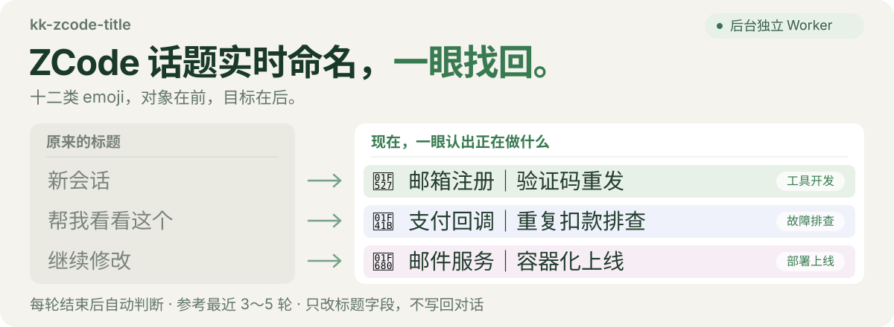
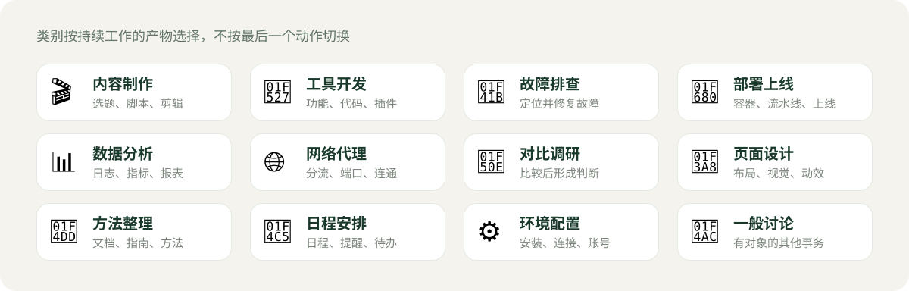

<p align="center">
  
</p>

# kk-zcode-title

为 ZCode 话题自动命名。每轮对话结束后，插件读取最近 3～5 轮摘录，将标题更新为 **「类别 emoji + 对象｜目标」**；主线不变时保留原标题。

## 效果

| 对话进展 | 标题 |
| --- | --- |
| 排查邮箱验证码过期 | `🐛 邮箱注册｜过期修复` |
| 继续补充边界测试 | `🐛 邮箱注册｜过期修复` |
| 修复后部署邮件服务 | `🚀 邮件服务｜容器化上线` |

标题跟随对话语言，按工作内容分类。手动修改或固定的标题不会被自动覆盖。

## 安装

需要 **ZCode、Python 3.10+**，无第三方 Python 依赖。将下面这句话发给 ZCode：

```text
安装并启用这个 ZCode 插件：https://github.com/kkfor30/kk-zcode-title
检查依赖，并告诉我还需要完成哪些配置。
```

首次安装会引导选择命名模型，复用 ZCode 已接入厂商的 API Key，试调成功后保存。安装或升级后，需**完全退出并重新打开 ZCode**。

<details>
<summary>手动安装</summary>

下载 [发布压缩包](https://github.com/kkfor30/kk-zcode-title/releases/latest/download/kk-zcode-title.zip) 并解压，执行 `python install.py`；也可以克隆：

```bash
git clone https://github.com/kkfor30/kk-zcode-title.git
cd kk-zcode-title
python install.py
```

安装器将插件复制到 `~/.zcode/plugins/kk-zcode-title` 并注册启用。安装后可删除下载目录，运行数据保存在 `~/.zcode/`。

</details>

## 使用

正常聊天即可自动命名。需要调整时，直接说：

| 想做什么 | 示例指令 |
| --- | --- |
| 查看或保留标题 | 「预览这个话题的新标题」「固定这个话题的标题」 |
| 暂停或恢复 | 「暂停自动命名」「恢复自动命名」 |
| 调整命名模型 | 「换命名模型」「加一个兜底厂商」 |
| 整理历史话题 | 「把历史会话也命名一下」——先预览再确认，每次最多 20 条 |
| 清理闲置话题 | 「预览可以归档的闲置话题」——默认关闭，确认后启用 |

归档只写时间戳，不删除数据。当前话题、手动保护或固定标题的话题、子代理会话不会归档。

## 工作方式

<p align="center">
  
</p>

命名在独立后台进程中完成；最近几轮摘录会发送给所选模型服务。模型配置与 ZCode 对话模型互不影响，可设置多家厂商依次兜底，失败厂商冷却 30 分钟。命名失败保留原标题，过期结果丢弃。

<details>
<summary>查看标题类别与旧版迁移</summary>



旧版 `🧩` 标题会重新判断类别，仅替换 emoji，保留对象与目标措辞。

</details>

## 使用边界

- ZCode 没有官方改名接口，插件直接更新会话库标题字段；客户端表结构变化时需重新检查兼容性。
- 标题已写入但侧边栏未刷新时，切换分组或重启客户端。
- 命名需要所选模型服务可用，不保证每轮都产生新标题。

## 卸载

在源码或解压目录运行 `python install.py --uninstall`。已删除下载目录时可重新下载。

卸载移除注册与安装副本，保留现有话题标题，以及 `~/.zcode/kk-zcode-title/` 中的数据和 Key 配置；确认弃用后可手动删除该数据目录。

## 许可

[MIT](LICENSE) · 命名规则的设计参考自 oil-codex-title
